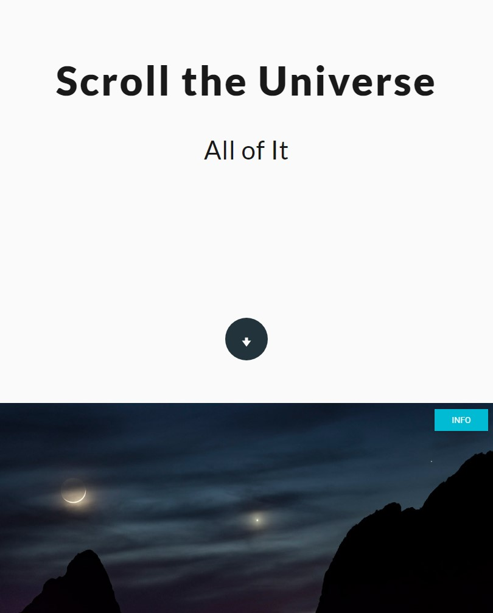

# Scroll the Universe
A more pleasing experience viewing the [astronomy pictures of the day](https://apod.nasa.gov/apod/).

A single page application build with react using [APOD](https://api.nasa.gov/api.html#apod) nasa api.

[View live](cubbk.github.io/scroll-the-universe)


## Install
```
  npm install
  npm start
```